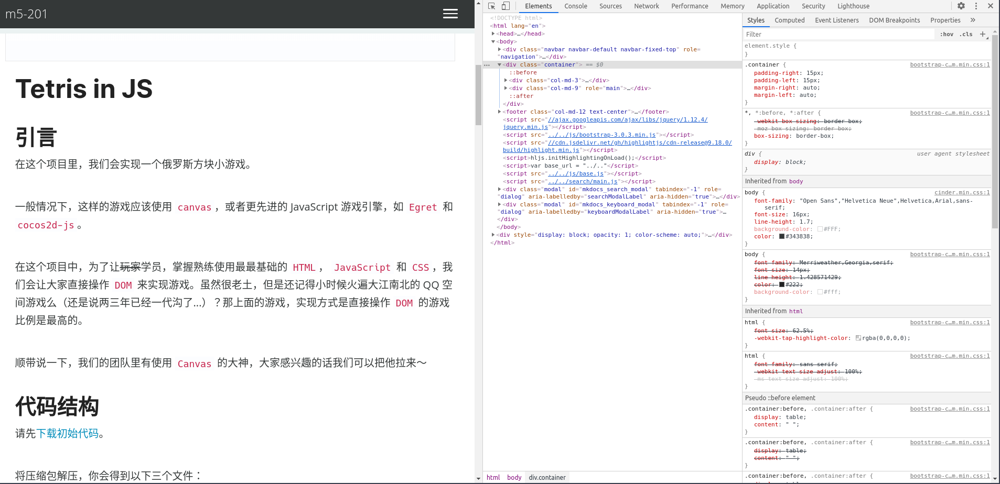

# 天下前端一大抄
> 我们的鼓励大家，用创新的思维去设计，用“抄袭”的方法去实现。  

（本篇内容仅代表一部分人的观点，也许不完全正确，欢迎讨论！）

## 导论

在设计一个前端页面以及功能的时候，我们要发挥创造力；但是在着手制作的时候，我们鼓励新手玩家去“抄袭”。

我们说的“抄袭”是这两层意思：  
  

1. 按需截取别人写好的局部布局  
2. 使用开源的工具，包括框架、组件和第三方库等  
 

如果你是新手，或者像笔者一样对 Web 前端不是很熟悉，适当的“抄袭”可以大大加快你的学习、开发速度，避免很多常见问题。  
 

比如，你不知道怎么做一个导航框，或者不知道怎么把弹窗做成你想要的效果。  
 

你可以先回忆一下在什么地方看到过其它网站的类似功能，然后去将它“抄”过来。  
（当然，对于比较通用或比较常见的问题，你可以运用<a href="../GOP">面向谷歌编程 </a>的技巧，更高效地得到解决方案。）  
 

**注意，请不要把别人的网站整个复制过来，把关键图片和文字替换成自己的，然后进行发布。这样就成了真正意义上的抄袭，被踢出创造营不说，还会引来道德上甚至法律上的问题。**  
 

那么应该怎么做呢？请往下看。  

## 复现页面元素
随便打开一个主流浏览器（如 `Chrome` 和 `Firefox`），右键点击页面，点击 `检查元素（inspect）`，可以看到屏幕边上出现一个面板。点击面板最上方的第一个标签（通常会叫 `元素（Elements）`），可以看到整个页面的 `HTML` 代码。  

你也可以直接点击最左上角的图标

然后把鼠标放在页面上，它会自动告诉你每个东西的标签是什么。  
 

定位到你想要实现的功能（有时候这也需要一点经验），然后将目标 `HTML` 代码复制到本地。在本地打开网页，可能会和原来的网页不太一样，因为你还需要把 `CSS` 样式也复制下来。  
 

你可以先看一下标签上的 `id` 以及 `class` 名，在原页面的元素中使用 `CTRL + f` 搜索对应的 `CSS` 样式，复制到你的 `HTML` 文件里，直到它和原网页看起来差不多。  
 

P.S. 我们推荐在复制的时候，大概阅读一下你复制的内容，不懂的话最好查一下每一句话是什么意思，这样会进步很快的。

## 开源工具
其实很多时候，这些代码不是网站作者自己写出来的，而是他们使用工具生成出来的。下面例举几个比较好用的工具：  
 

### 特效生成器
如果你记不住各种 `CSS` 的属性，除了现用现查之外，最好的办法就是使用工具自动生成。  
 

[这个链接](https://angrytools.com/css-generator/border/) 可以让你像做 `PPT` 那样，方便地生成并测试你想要的效果。  
 

或者，直接搜一下 `CSS generator`，然后挑选你喜欢的工具。  
 

生成完毕后，复制到你的 `CSS` 代码中即可。  

### `Bootstrap`
[`Bootstrap`](https://getbootstrap.com/) 是一堆用 `CSS` 写好的样式（以及一些用来控制组件的 `JavaScript`）。  
你只需要在你的 `HTML` 元素上，打上特定的 `class` 标签，就能让样式发挥效果了。  
 

具体的使用方法如下：  
1. 在 `Bootstrap` 的 [Get started](https://getbootstrap.com/docs/5.0/getting-started/introduction/) 页面找到引用的方法（只需要在你的 `HTML` 文件对应位置加入几个 `<link></link>` 和 `` 就行）。这个过程实际上告诉了页面，去因特网的某个地址把他们写好的 `CSS` 和 `JavaScript` 文件拿过来用。  
2. 在 [Docs](https://getbootstrap.com/docs/5.0/getting-started/introduction/) 页面找到自己喜欢的组件或样式，加到自己代码里。  
 

个人认为，`Bootstrap` 中最好用的，当属 `Layout` 下的 `Columns`。它提供了很清晰的排版方式，并且允许你同时适配电脑端与手机端。

