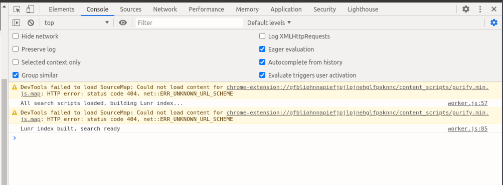

# Debugging

Debug 就是给程序查错，是非常重要的编程能力。鉴于大家都已经有一些编程经验了，我们就简单说一下 `JavaScript` 中 debug 的方法。  
<br>

首先，像其它语言一样，你可以在程序中加入打印命令。`JavaScript` 中，你可以使用 `console.log()` 这个函数。与其它语言不同的是，你可以把任何东西塞到这个函数里进行输出，`JavaScript` 会很贴心地把变量内部结构解析地清清楚楚。  
<br>

要看到输出的内容，你可以用浏览器打开正在开发的网页，按下 `F12`，点击出现的面板上的 `Console（控制台）`，查看 `console.log()` 的输出。



你也可以直接在 `console` 输入命令并运行。比方说你在 `JavaScript` 中定义了一个数组 `x`，你可以直接输入 `console.log(x[10])` 查看它的第 10 个元素。  


## 关于 `undefined`
在很多语言中，如果你使用了一个对象不存在的 attribute，你会得到一个明确的错误。但是，在 `JavaScript` 中，你会得到一个 `undefined` 的值，然后程序会正常运行，不会给出任何错误信息。比如以下片段，不会有任何问题：

```javascript
x.a = 1;
if (x.b + 1 < 3) {
    console.log("yes")
} else {
    console.log("no")
}
```
因为，`x.b` 返回的是 `undefined`，它是一个合法的值，`undefined + 1` 会得到 `NaN`，它无论怎么比较都是 `false`，所以这段程序会打印 `no`。请务必注意这一点。这使得 `JavaScript` 是很容易出错、很难 debug 的语言。
