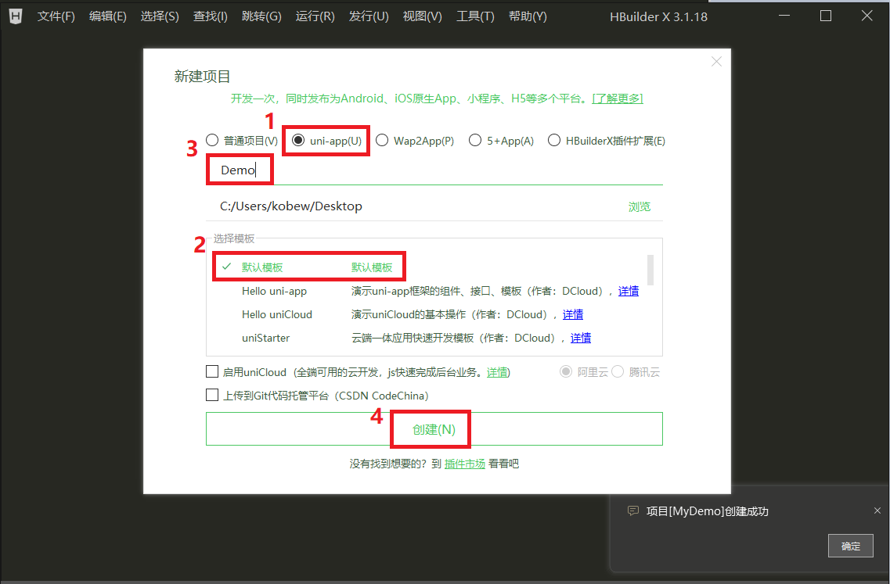
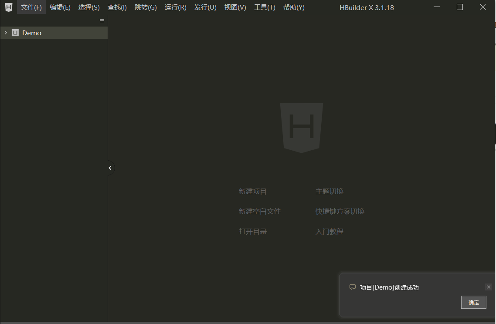
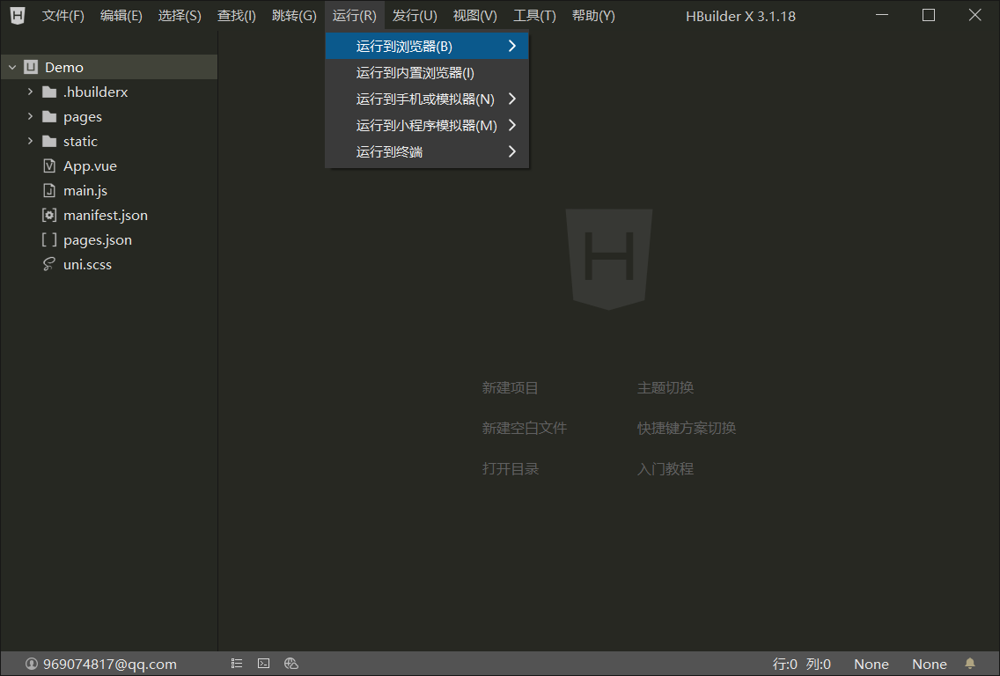
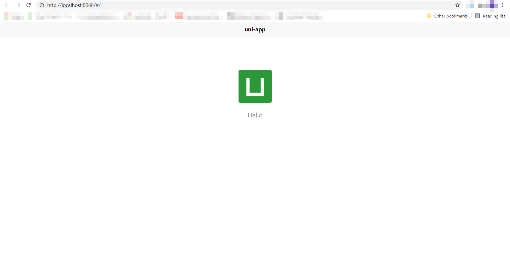

# Uni-app_使用及调试

## 开始之前

首先，我们需要做一些准备工作，想必大家都简单便捷地开始我们对 uni-app 的探索，因此我们将会使用一款 IDE （HBuilderX）。HBuilderX 内置相关环境，开箱即用，无需配置 node.js 可以节省大家的宝贵时间。 

HBuilderX：[官方IDE下载地址](https://www.dcloud.io/hbuilderx.html)

## 新建一个 uni-app 项目

1. 通过 文件 → 新建 → 1.项目 在 HBuilder X 中尝试新建一个项目
   
    
    
1. 选择 HBuilder X 提供的项目模板，我们默认选择 uni-app → 默认模板 → 将项目命名为 Demo → 最后点击 创建
   
    
    
1. 太棒了！我创建出了我们的第一个 uni-app codebase!
   
    
    

## 运行一个 uni-app 项目

1. 首先为避免 [CORS 跨域机制](https://developer.mozilla.org/zh-CN/docs/Web/HTTP/CORS) 影响本地调试，我们需要屏蔽 Chrome 的跨域检测机制
    1. 在桌面上新建文件夹Access-Control-Allow-Origin
    2. 找到桌面上的chrome快捷图标，右键 属性 ，找到目标输入框那里
    3. 在目录输入框后加上 “–disable-web-security --user-data-dir=**【 'Access-Control-Allow-Origin' 文件的路径】(e.g. –disable-web-security --user-data-dir=C:\Users\Kobe超帅\Desktop\Access-Control-Allow-Origin)**” 
    4. 以管理员身份打开，搞定
2. 通过 运行 → 运行到浏览器 → Chrome 将 uni-app 程序运行到 Chrome
   
    (命令行运行形式需要环境配置，较为复杂，在此暂不做赘述)
    
    
    
3. 此时若未进行跨域操作，则 Chrome 会自动跳转并渲染页面
   
    
    
4. 如出现此类报错，尝试在屏蔽检测的 Chrome 内打开对应路径即可
   
    
    

## 看到这里，让我们正式开始我们的 uni-app ( VUE ) 探索之旅吧！

                                                                                                                                        By KobeNorris