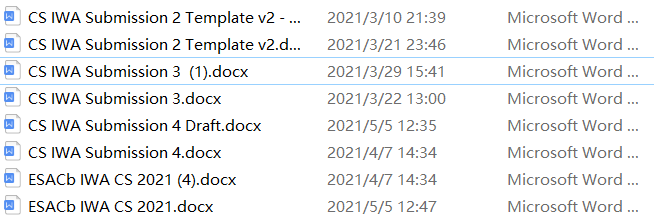

# Git

# 引言

不知道你有没有过这种经历：

你写好了一份代码，准备提交的时候，突然有个更好的点子，想改动一下，但是又不敢动手，怕改坏了。于是你把代码备份了一份，这才放心删改起来。

你疯狂敲键盘，点子逐渐成型，然而你这时候你的点子出现了分支：是走 A 路线，还是走 B 路线呢？你陷入了沉思，于是又把代码复制了一份...

当你完成这个项目之后，你发现你的代码被复制了几十份，放在你的硬盘里，文件名乱七八糟，甚至分不出每份代码到底是哪个阶段的，想回到某个节点的话，得还原哪份带代码。

这还只是一个人 solo 一个项目的情况。如果有十来个人一起工作，每个人都有自己的一点小想法，把代码复制一遍进行尝试，很快整个项目就变成了屎山（Pi, 2021）。

为了避免这种情况，我们强烈推荐使用 `git` 。这是一个非常好用的版本管理工具。

# Git是什么？

> 标准答案：Git 是一个开源的**分布式**版本控制系统。

让我们一步步来理解这个答案。首先，Git本质上是一个**版本控制器**，这个名字可能有些陌生，但大家平时都有接触到。比如，某些app编辑栏里的*撤销* 、*重做* 或是浏览器的历史记录管理。简单的来说，你可以通过浏览器的history再次打开你之前浏览过的页面，而通过git这个版本控制系统，程序猿们可以回到之前每一次的保存记录。git 会把每次改动的信息都完整地保存在一个地方，这样你就可以随时查看、还原，非常方便。

### 版本控制器的用途

举个栗子，或许大家工作学习中遇到过下列情况：

不敢改原稿，新建了十多个副本

每次都是复制粘贴副本，产出的文件就越来越多，文件多不是问题，问题是：随着版本数量的增多，你还记得这些版本各自都是修改了什么吗？

为了能够更方便我们管理这些不同版本的文件，于是有了版本控制器。

### 什么让Git脱颖而出?

这里涉及到git的一些设计理念，用来管理文件版本的工具并不只有GIt一个，著名的还有CVS / Subversion等等，与他们相比主要差别在于 Git 对待数据的方式，Git的保存提交方式更粗暴，直接用类似与屏幕快照的方式，把你在某一时刻的数据全部用一个相机拍下来。如果把你的代码成果想象成一个房间，把所有的数据想象成房间里的装饰，那么git就是那个相机，用来记录某一时刻房间内的场景，然后程序猿可以翻相册，通过索引照片回到那个时空。

除此之外Git还有一个最大的特点——采用了**分布式**版本库的方式（就是去中心化）每个开发人员的计算机存储整个项目的所有历史版本，储存在一个**仓库**里，这赋予它可以离线工作的特性。

为了更好的理解分布式的概念，我们先来讲一讲集中式版本控制系统，他们的版本库是集中放在中央服务器的，打个比方，钢铁侠系列电影中初代战衣全靠主角胸口的反应堆驱动，一旦被反派抢走就会陷入瘫痪（笔者想不出例子，大家悟一下）。但是分布式没有这种缺陷，它并不依赖中央服务器工作，近乎所有操作都是本地执行，如果你在飞机或火车上想做些工作，就能愉快地提交， 直到有网络连接时再上传。

# Git的工作原理

首先，你需要声明，要让git去追踪（track)哪些文件。当你创建新文件的时候，需要把它加入`追踪`的列表中。

对于任何一个文件，在Git内部都只有三种状态：已修改，已暂存和已提交。

- 已修改 表示修改了某个文件，但还没有提交保存
- 已暂存 表示把已修改的文件放在下次提交时要保存的清单中
- 已提交 表示该文件已经被安全的保存在本地数据库中

打个比方，把git想象成你的管家：

“已修改”意味着你对一些文件做出了改动，但管家还不知道；

“已暂存”意味着你告诉管家，帮我盯着这些改动过的文件，但他不会做任何事；

“已提交”意味着你让管家把这些文件拍照保存下来，放到书架上去。

然后，每次你认为你的工作进行到了一定的阶段（i.e. 需要备份一下你的代码的节点），你需要用 `git` 去`提交（commit）`所有被`追踪（track）`的文件，这样，相当与备份了一下。- 当你有需要的时候，你可以用 `git` 去`回溯（checkout）`某个版本的文件。

本地基本的Git工作流程如下：  在本地的工作目录修改某些文件；然后对修改后的文件进行快照，保存到暂存区域；最后提交更新，将保存在暂存区域中的文件快照永久转存到Git的工作目录中。

还要注意到的一点是：提交（commit）不会对原始文件做出修改，git仅仅是拍了一个文件快照，就像你给朋友拍了一张照片，但不意味着你朋友就跑到照片里去，变成一个纸片人。

不止这些，你可以创建一个`分支（branch）`。你可以把代码备份（提交）到分支上。- 你可以把一个`分支``合并（merge）`到另一个`分支`上，`git` 会自动分析两个分支之间的相同与不同之处，非常方便。

`分支`和`合并`的功能在团队合作的时候尤其有用。通常，企业分工的时候，我们会每个人创建一个`分支`，在`分支`上开发一个具体的功能，完成后再`合并`回主分支。

Git 速度快，非常灵活，这对于大项目来说很重要。 Git 最为出色的是它的合并跟踪能力（这会在github教程中进一步阐述），被Linus Torvalds称为傻瓜内容跟踪器。随着开发的深入，Git 的正常使用都由一些友好的脚本命令来执行，使 Git 变得非常好用，即使是用来管理我们自己的开发项目，Git 都是一个友好，有力的工具。现在，越来越多的著名项目采用 Git 来管理项目开发。

当然git的功能不止于此，用于大项目的开发势必会需要多人合作，之前我们说到Git分布式的特性——每个项目成员的电脑都有一个完整的版本库，这会引申出一个问题：**多个人如何协作呢**？每个成员的工作成果都保存在本地，如何把各自的修改推送给对方就成了一个问题，比如说自己在电脑上修改了文件A，其他人也在电脑上修改了文件A，这时，你们两之间需要互相统一修改内容，知道对方的修改了什么。那么如何把各自的修改推送给对方呢？用微信发肯定不行，这里我们不得不提到Github。

# GitHub

之前说到，Git采用了分布式版本库的方式，这意味着每个项目成员的电脑都有一个完整的版本库，如果你想分享你的代码或者与其他开发人员合作，你就需要直接把数据用微信发给对方，通过某种方法发送给对方。更直接的方法是，**把数据放到公开的地方让别人下载（说的就是Github）**。

GitHub简单来说是一个基于web的Git仓库，提供分享开源项目的平台，我们可以在上面建立仓库。

Git就像一座通向GitHub的桥梁。我们可以通过git把本地项目上传到GitHub，同时也可以通过git从GitHub上下载项目到本地。

你可以在上面共享工作成果，比较出名的开源软件都会在上面发布自己的代码，你也可以在上面淘到海量的代码，总之非常的牛逼实用。

今天，GitHub已是：

- 一个拥有143万开发者的社区。其中不乏Linux发明者[Torvalds](https://github.com/torvalds)这样的顶级黑客，以及Rails创始人[DHH](https://github.com/dhh)这样的年轻极客。
- 这个星球上最流行的开源托管服务。
