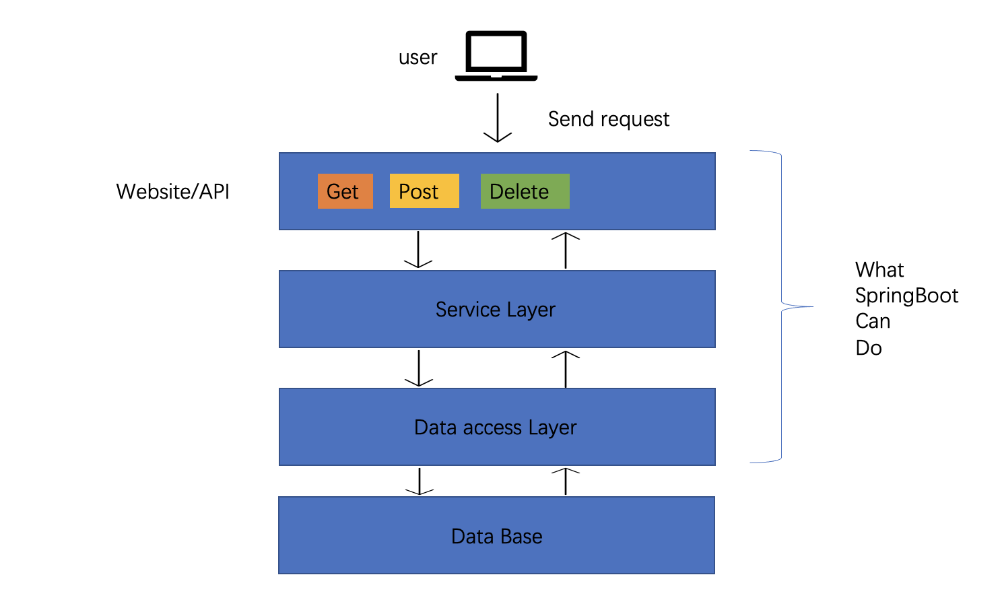

# springboot_引入

# SpringBoot

## 引入

### 假想一下

如果A问B明天天气，B暂时不知道天气，但是B知道C知道明天的天气

此时为了让A知道天气，流程大致为

1. B向C询问天气
2. 等C告诉B天气
3. B把C告诉B的天气告诉A

这样A就成功知晓了天气

如果用户向服务器请求天气信息，过程也是类似，但首先我们要先引入一个概念，API：

### API（Application Programming Interface，应用程序接口）：

是一些预先定义的接口（如函数、HTTP接口），或指软件系统不同组成部分衔接的约定。 用来提供应用程序与开发人员基于某软件或硬件得以访问的一组例程，而又无需访问源码，或理解内部工作机制的细节。

就相当于我们不用了解网站背后的数据库到底长什么样，我们只要知道网站到底能干嘛，并且向API按规定格式发送请求，就可以收到我们想要获得的数据。

此时用户就是A，数据库就是C，而API则要扮演的是B的角色

过程也可以分为以下几个步骤

1. API就去问数据库要这些信息
2. 数据库给API返回这些信息
3. API将数据库返回的信息传达给用户

此时用户就可以成功请求到他想要的信息了

其实除了天气网站，其他很多网站都需要经常更新网页上的数据以保证时效性，例如股市指数，电影评分，数据每发生一点点变化就要人手工操作一页页去改html的文件是非常低效率的，此时就需要用到springboot了。

## SpringBoot能干啥

springBoot 可以帮我们简化搭建网站的流程，可以为我们提供包管理工具，更快捷的将数据库和网页连接起来。

### 反正就是两个字，方便

### SpringBoot的作用如图：

